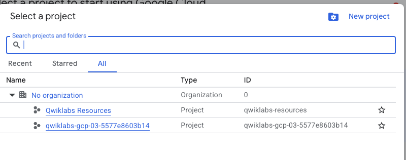

## Seleccion del proyecto correcto



```Shell
Welcome to Cloud Shell! Type "help" to get started.
To set your Cloud Platform project in this session use `gcloud config set project [PROJECT_ID]`.
You can view your projects by running `gcloud projects list`.
<pre class="ql-code"> 05fPendgVnqV</pre>
student_02_a7f1504efabd@cloudshell:~$ 
```

#### 2. Solicitud del nombre de la cuenta activa con este comando:

```Shell
$ gcloud auth list
Credentialed Accounts

ACTIVE: *
ACCOUNT: student-02-cb3c9284ad97@qwiklabs.net

To set the active account, run:
    $ gcloud config set account `ACCOUNT`
```

#### 5. Solicita el ID del proyecto.

```Shell
$ gcloud config list project
[core]
project (unset)

Your active configuration is: [cloudshell-29213]
```

realizamos set de proyecto con el siguiente comando:

```Shell
$ gcloud config set project qwiklabs-gcp-03-5577e8603b14
[environment: untagged] Read more to tag: g.co/cloud/project-env-tag.
Updated property [core/project].
```
Luego el comando `gcloud config list project` nos muestra el proyecto activo:

```shell
$ gcloud config list project
[core]
project = qwiklabs-gcp-03-5577e8603b14

Your active configuration is: [cloudshell-10394]
```

## Tarea 1 crear una red.

Creamos una red VPC en modo personalizado con el siguiente comando:


```Shell
gcloud compute networks create labnet --subnet-mode=custom
ERROR: (gcloud.compute.networks.create) The required property [project] is not currently set.
It can be set on a per-command basis by re-running your command with the [--project] flag.

You may set it for your current workspace by running:

  $ gcloud config set project VALUE

or it can be set temporarily by the environment variable [CLOUDSDK_CORE_PROJECT]
```

Este error nos daba precisamente porque anteriormente no habíamos seteado el proyecto activo. Una vez seteado el proyecto activo, volvemos a ejecutar el comando para crear la red VPC:

```Shell
$ gcloud compute networks create labnet --subnet-mode=custom
Created [https://www.googleapis.com/compute/v1/projects/qwiklabs-gcp-03-5577e8603b14/global/networks/labnet].
NAME: labnet
SUBNET_MODE: CUSTOM
BGP_ROUTING_MODE: REGIONAL
IPV4_RANGE: 
GATEWAY_IPV4: 
INTERNAL_IPV6_RANGE: 

Instances on this network will not be reachable until firewall rules
are created. As an example, you can allow all internal traffic between
instances as well as SSH, RDP, and ICMP by running:

$ gcloud compute firewall-rules create <FIREWALL_NAME> --network labnet --allow tcp,udp,icmp --source-ranges <IP_RANGE>
$ gcloud compute firewall-rules create <FIREWALL_NAME> --network labnet --allow tcp:22,tcp:3389,icmp
```

## Tarea 2 crear una subred.
Creamos una subred en la red VPC creada anteriormente, en la region us-east1 y con un rango de IPs de 10.0.0.0/28.

```shell
$ gcloud compute networks subnets create labnet-sub --network labnet --region us-east1 --range 10.0.0.0/28
Created [https://www.googleapis.com/compute/v1/projects/qwiklabs-gcp-03-5577e8603b14/regions/us-east1/subnetworks/labnet-sub].
NAME: labnet-sub
REGION: us-east1
NETWORK: labnet
RANGE: 10.0.0.0/28
STACK_TYPE: IPV4_ONLY
IPV6_ACCESS_TYPE: 
INTERNAL_IPV6_PREFIX: 
EXTERNAL_IPV6_PREFIX: 
```

## Tarea 3: Visualiza las redes

```Shell
gcloud compute networks list
NAME: default
SUBNET_MODE: AUTO
BGP_ROUTING_MODE: REGIONAL
IPV4_RANGE: 
GATEWAY_IPV4: 
INTERNAL_IPV6_RANGE: 

NAME: labnet
SUBNET_MODE: CUSTOM
BGP_ROUTING_MODE: REGIONAL
IPV4_RANGE: 
GATEWAY_IPV4: 
INTERNAL_IPV6_RANGE: 
```

Observamos que la red VPC creada es labnet y que su modo de subred es CUSTOM. La red default es la que viene por defecto en cada proyecto y su modo de subred es AUTO.


## Tarea 4: Enumerar las subredes

```Shell
$ gcloud compute networks subnets list --network=labnet
NAME: labnet-sub
REGION: us-east1
NETWORK: labnet
RANGE: 10.0.0.0/28
STACK_TYPE: IPV4_ONLY
IPV6_ACCESS_TYPE: 
INTERNAL_IPV6_PREFIX: 
EXTERNAL_IPV6_PREFIX: 
UTILIZATION_DETAILS: 
```

Observamos la unica subred creada en la red VPC labnet, que es labnet-sub.