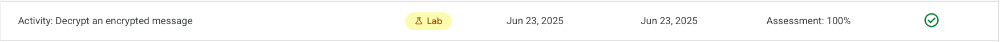

# Activity Summary 

Module 2 lab 1 of the course **Assets, Threats, and Vulnerabilities** of the Google Cybersecurity Certificate

I performed a guided decryption workflow in a Linux shell where simulated user data had been encrypted. I inspected directory contents, uncovered a hidden file containing a Caesar cipher, translated its shifted text, and then used the revealed OpenSSL command to decrypt an AES‑256‑CBC encrypted file to recover the final message.

## Objectives accomplished

- Listed visible and hidden files in a user home directory using basic Linux commands.
- Read instructional content and identified a hidden dotfile containing a Caesar cipher.
- Decrypted the Caesar cipher with `tr` by reversing a left shift of 3 characters.
- Applied the provided OpenSSL command to decrypt an AES‑256‑CBC file with PBKDF2 key strengthening.
- Validated successful recovery of plaintext by comparing file presence and contents.

## Folder Structure and Status

- Readme.md: Activity summary and objectives (this file).
- activity_decrypt.md: Original lab instructions (source reference).

