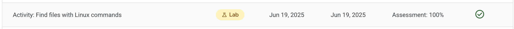

# Activity Summary 

Module 2, Lab 3 from **Tools of the Trade: Linux and SQL** (Google Cybersecurity Certificate): Google Cloud lab focused on locating files with core Linux shell commands.

In this Google Cloud activity, I navigated a Debian-based filesystem using Bash commands to discover directories, read files, and answer investigative questions. The lab reinforced essential Linux navigation skills for security analysts working without a graphical interface.

## Objectives accomplished

- Used `pwd`, `ls`, and `cd` to confirm and change directories.
- Displayed file contents with `cat` and `head` to extract relevant details.
- Counted warnings and traced user information from structured text files.
- Documented commands, outputs, and screenshots for reproducibility.

## Folder Structure and Status

- LabSolution.md: Command-by-command solution with validation notes.
