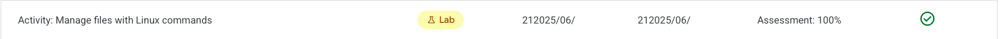

# Activity Summary 

Google Cloud lab: Manage files and directories with Linux commands in a Bash environment.

In this activity I organized the `/home/analyst` workspace using core shell commands. I created and removed directories, moved and deleted files, and used a text editor to document the work. The lab demonstrates day‑to‑day file management tasks essential for security analysts working on Linux.

## Objectives accomplished

- Created a new `logs` subdirectory under `/home/analyst`.
- Removed the obsolete `temp` subdirectory.
- Moved `Q3patches.txt` from `notes` to `reports` and validated results.
- Deleted the unused `tempnotes.txt` file in `notes`.
- Created `notes/tasks.txt` and added a brief activity log.

## Folder Structure and Status

- LabSolution.md: Step‑by‑step commands, expected outputs, and quick checks.
- MaterialDeApoyo/ManageFilesWithLinuxCommands.md: Course walkthrough used as reference (read‑only).
- MaterialDeApoyo/image.png, image-1.png: Screenshots from the lab (read‑only).
