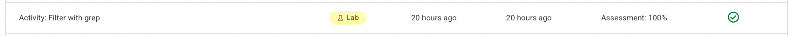

# Activity Summary 

Module 2, Lab 4 from Tools of the Trade: Linux and SQL (Google Cybersecurity Certificate): Google Cloud lab focused on filtering log data with `grep` and pipes.

In this Google Cloud activity, I practiced using `grep` to isolate error messages, filter filenames by keyword, and extract user management updates from quarterly reports. The workflow demonstrates how a security analyst can quickly pivot through Linux directories and answer investigative questions with a couple of well-crafted commands.

## Objectives accomplished

- Navigated log directories and filtered `server_logs.txt` for error entries.
- Combined `ls` with `grep` to list only quarterly reports or access files containing specific strings.
- Queried quarterly user rosters to confirm deleted accounts and new Human Resources hires.
- Captured the command syntax, expected output, and validation notes for repeatability.

## Folder Structure and Status

- LabSolution.md: Step-by-step command log with results and validation checks.
- activity_filter_with_grep.md: Exported lab instructions for reference.
